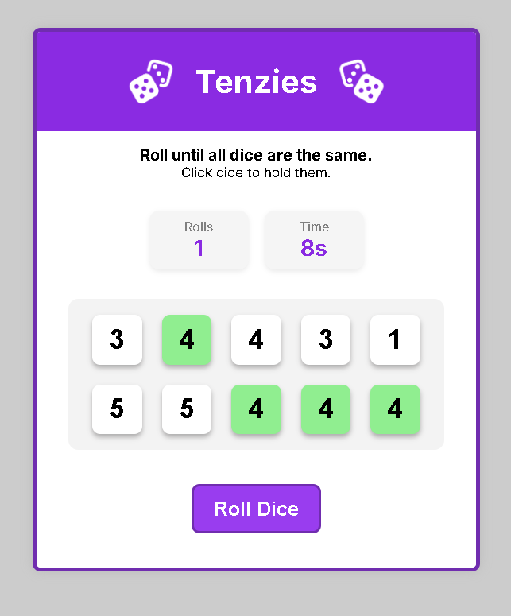
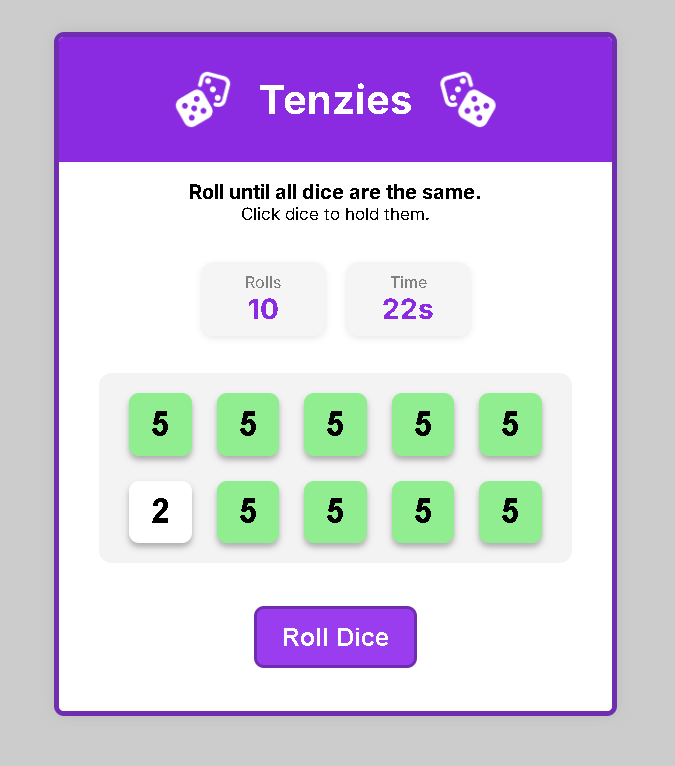
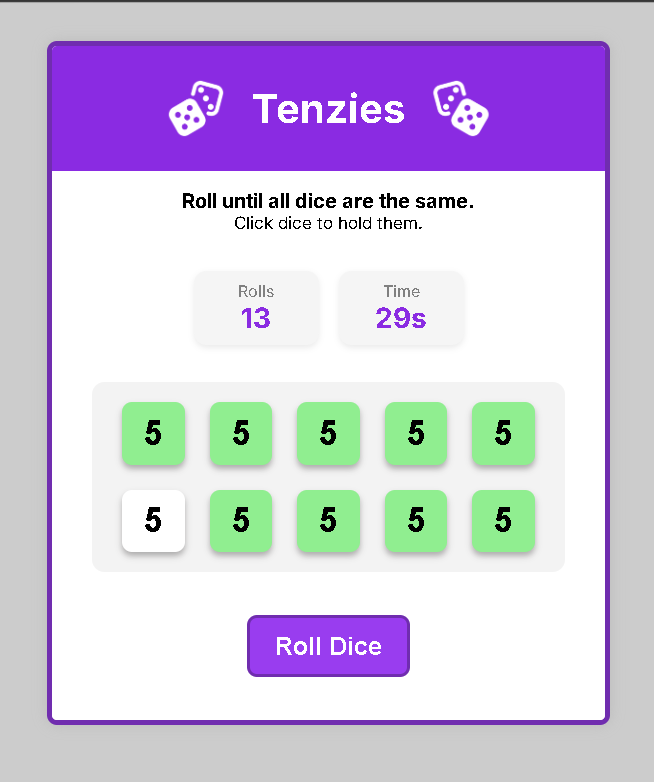
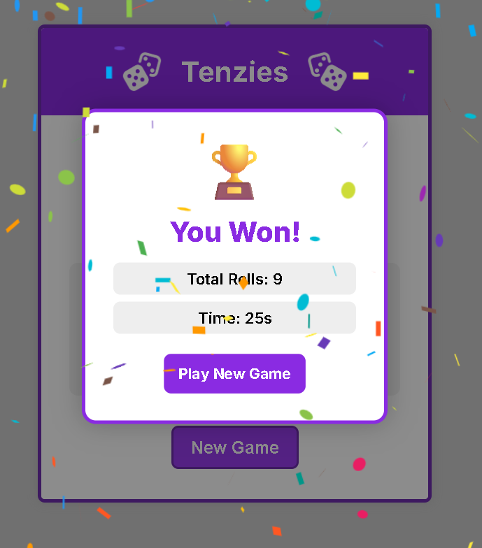

# 🎲 Tenzies — A Dice Rolling Game

A modern and interactive **Tenzies game** built with **React.js**.
Roll the dice, hold matching values, and try to get all 10 dice showing the same number before the timer runs out!

---

# ✨ Features

* 🎲 Random dice generation
* ✋ Hold / unhold dice
* ⏱️ Real-time timer
* 🔢 Roll counter
* 🏆 Win detection system
* 🎉 Confetti celebration animation
* 📊 Winning stats screen
* 📱 Responsive UI
* ⚛️ Component-based React architecture

---

# 📸 Screenshots

## 🎮 Main Game Screen



---

## 🎲 Gameplay in Progress



---

## 🧠 Strategy Gameplay



---

## 🏆 Winning Screen



---

# 🛠️ Technologies Used

* ⚛️ React.js
* ⚡ Vite
* 🎨 CSS3
* 🎉 react-confetti

---

# 🧠 Game Rules

1. Roll all dice
2. Click dice to hold matching values
3. Re-roll remaining dice
4. Win when:

   * All dice are held
   * All dice have the same number

---

# 📂 Project Structure

```bash id="zt1p5v"
src/
│
├── assets/
├── components/
│   ├── Header.jsx
│   ├── Main.jsx
│   ├── Die.jsx
│   ├── WinScreen.jsx
│   └── winscreen.css
│
├── App.jsx
├── App.css
├── index.css
```

---

# ⚙️ Installation

Clone the repository:

```bash id="6sm8lr"
git clone https://github.com/ThisisAlam/Tenzies-a-dice-rolling-game.git
```

Move into the project directory:

```bash id="p9k2wj"
cd Tenzies-a-dice-rolling-game
```

Install dependencies:

```bash id="1v7xqf"
npm install
```

Run the development server:

```bash id="b4n6tm"
npm run dev
```

---

# 🚀 Future Improvements

* 🥇 Best score tracking
* 🌙 Dark mode
* 🔊 Sound effects
* 💾 Local storage support
* 📱 Better mobile animations
* 🧠 Difficulty levels

---

# 👨‍💻 Developer

Made with ❤️ by **Fakhar Alam**

---

# ⭐ Support

If you enjoyed this project, consider giving it a **star ⭐** on GitHub!
